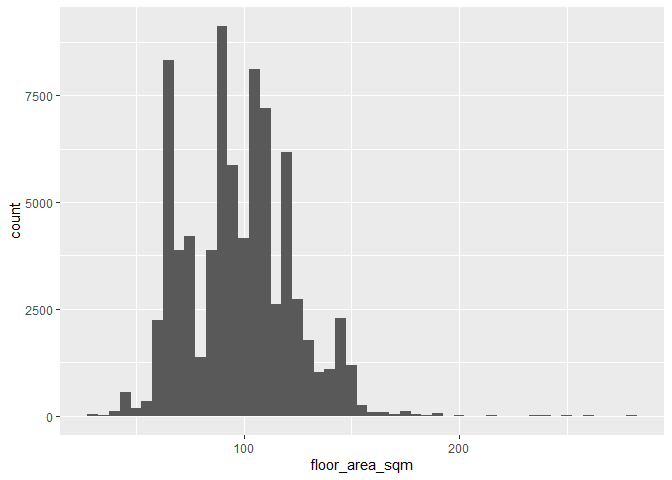
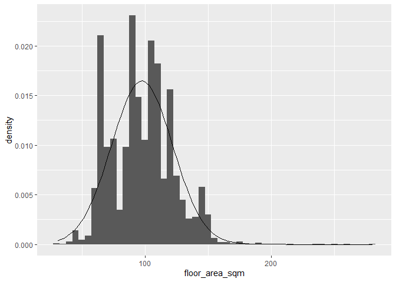
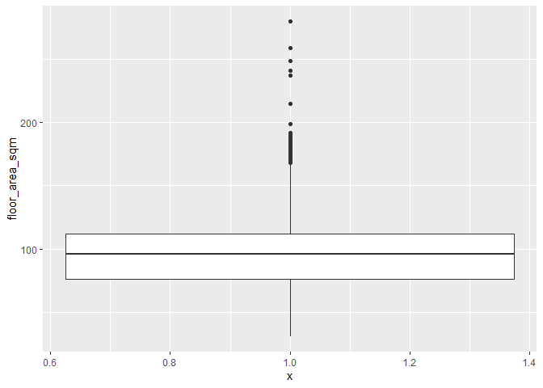
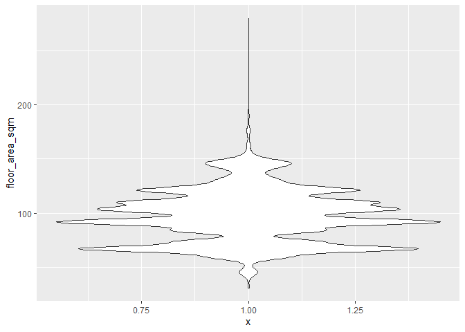
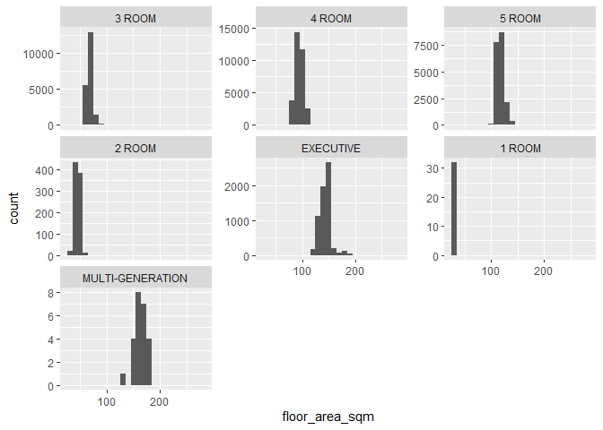
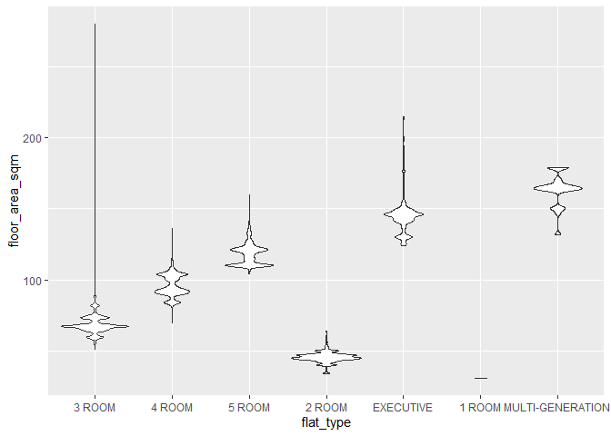

R Notebook
================

``` r
library(tidyverse)
```

    ## -- Attaching packages ----------------------------------------------------------- tidyverse 1.3.0 --

    ## v ggplot2 3.3.2     v purrr   0.3.4
    ## v tibble  3.0.3     v dplyr   1.0.0
    ## v tidyr   1.1.0     v stringr 1.4.0
    ## v readr   1.3.1     v forcats 0.5.0

    ## -- Conflicts -------------------------------------------------------------- tidyverse_conflicts() --
    ## x dplyr::filter() masks stats::filter()
    ## x dplyr::lag()    masks stats::lag()

``` r
library(here)
```

    ## here() starts at C:/Users/Kateryna/Documents/2020/IndependentStudy/Rstudio

``` r
library(e1071)
library(skimr)
library(lubridate)
```

    ## 
    ## Attaching package: 'lubridate'

    ## The following objects are masked from 'package:base':
    ## 
    ##     date, intersect, setdiff, union

``` r
library(forcats)
library(ggplot2)
sales <- readRDS(here::here("data/sales.rds"))
```

``` r
# Chapter3: 2 different types of descriptive statistics: measures of the central tendency and measures of dispersion.

# 3.2 Central Tendency
mean(sales$floor_area_sqm) 
```

    ## [1] 97.58903

``` r
median(sales$floor_area_sqm)
```

    ## [1] 96

``` r
# from https://stackoverflow.com/a/25635740
manual_mode <- function(x, na.rm = FALSE) { # we don't use 'mode' as a function name because it already exists
  if(na.rm){
    x = x[!is.na(x)]
  }
  ux <- unique(x)
  return(ux[which.max(tabulate(match(x, ux)))])
}

manual_mode(sales$floor_area_sqm)
```

    ## [1] 67

``` r
"Range"
```

    ## [1] "Range"

``` r
max(sales$floor_area_sqm) - min(sales$floor_area_sqm)
```

    ## [1] 249

``` r
"Interquartile Range"
```

    ## [1] "Interquartile Range"

``` r
IQR(sales$floor_area_sqm)
```

    ## [1] 36

``` r
"Standard Deviation"
```

    ## [1] "Standard Deviation"

``` r
sd(sales$floor_area_sqm)
```

    ## [1] 24.22276

``` r
"Coefficient of variation"
```

    ## [1] "Coefficient of variation"

``` r
sd(sales$floor_area_sqm) / mean(sales$floor_area_sqm)
```

    ## [1] 0.2482119

``` r
"Kurtosis and Skewness from the 'e1071` library"
```

    ## [1] "Kurtosis and Skewness from the 'e1071` library"

``` r
kurtosis(sales$floor_area_sqm)
```

    ## [1] -0.1450646

``` r
skewness(sales$floor_area_sqm)
```

    ## [1] 0.2770161

``` r
"Summary"
```

    ## [1] "Summary"

``` r
summary(sales$floor_area_sqm)
```

    ##    Min. 1st Qu.  Median    Mean 3rd Qu.    Max. 
    ##   31.00   76.00   96.00   97.59  112.00  280.00

``` r
"Skim"
```

    ## [1] "Skim"

``` r
skim(sales$floor_area_sqm)
```

|                                                  |                        |
| :----------------------------------------------- | :--------------------- |
| Name                                             | sales$floor\_area\_sqm |
| Number of rows                                   | 79100                  |
| Number of columns                                | 1                      |
| \_\_\_\_\_\_\_\_\_\_\_\_\_\_\_\_\_\_\_\_\_\_\_   |                        |
| Column type frequency:                           |                        |
| numeric                                          | 1                      |
| \_\_\_\_\_\_\_\_\_\_\_\_\_\_\_\_\_\_\_\_\_\_\_\_ |                        |
| Group variables                                  | None                   |

Data summary

**Variable type:
numeric**

| skim\_variable | n\_missing | complete\_rate |  mean |    sd | p0 | p25 | p50 | p75 | p100 | hist  |
| :------------- | ---------: | -------------: | ----: | ----: | -: | --: | --: | --: | ---: | :---- |
| data           |          0 |              1 | 97.59 | 24.22 | 31 |  76 |  96 | 112 |  280 | ▃▇▁▁▁ |

``` r
ggplot(sales, aes(x = floor_area_sqm)) + 
  geom_histogram(binwidth = 5)
```

<!-- -->

``` r
ggplot(sales, aes(x = floor_area_sqm)) + 
  geom_histogram(aes(y = ..density..), binwidth = 5) +
  stat_function(fun = dnorm, args = list(mean = mean(sales$floor_area_sqm), sd = sd(sales$floor_area_sqm)))
```

<!-- -->

``` r
sales %>% 
  filter(floor_area_sqm == 67) %>% 
  View()
```

``` r
ggplot(sales, aes(x = 1, y = floor_area_sqm)) + 
  geom_boxplot()
```

<!-- -->

``` r
ggplot(sales, aes(x = 1, y = floor_area_sqm)) + 
  geom_violin()
```

<!-- -->

``` r
ggplot(sales, aes(x = floor_area_sqm)) + 
  geom_histogram(binwidth = 10) +
  facet_wrap(vars(flat_type), scales = "free_y")
```

<!-- -->

``` r
ggplot(sales, aes(x = flat_type, y = floor_area_sqm)) + 
  geom_violin()
```

<!-- -->

``` r
# exploration of all variables in the dataset. 

#Summarize the different continuous variables (area, price, remaining lease) as well as the nominal/ordinal variables (month, flat_type, town, flat_model, storey_range), summarize these variables in both table (stats on central tendency and distribution) and visual form.

#Analyze the distribution of (some of) these variables for different subsets of the data. For example, explore the difference between towns, or between flat types.

#Analyze the distribution of at least one variable for unique combinations of town and flat_type (for each town, for each flat type: Ang Mo Kio, 1 room; Ang Mo Kio 2 room; etc.)

#Analyze change in resale price per square meter over time. Use a 6-month moving average to do so.
```
