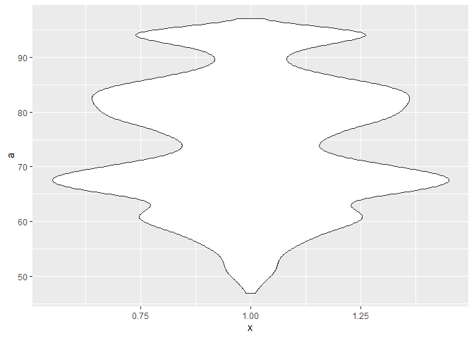
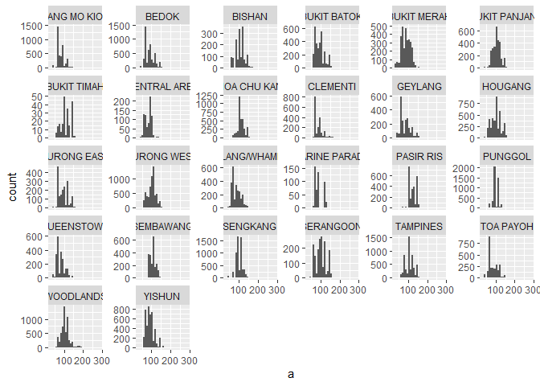

Block3\_assignment1
================

``` r
library(tidyverse)
```

    ## -- Attaching packages ----------------------------------------------------- tidyverse 1.3.0 --

    ## v ggplot2 3.3.2     v purrr   0.3.4
    ## v tibble  3.0.3     v dplyr   1.0.0
    ## v tidyr   1.1.0     v stringr 1.4.0
    ## v readr   1.3.1     v forcats 0.5.0

    ## -- Conflicts -------------------------------------------------------- tidyverse_conflicts() --
    ## x dplyr::filter() masks stats::filter()
    ## x dplyr::lag()    masks stats::lag()

``` r
library(here)
```

    ## here() starts at C:/Users/Kateryna/Documents/2020/IndependentStudy/Rstudio

``` r
library(e1071)
library(skimr)
library(lubridate)
```

    ## 
    ## Attaching package: 'lubridate'

    ## The following objects are masked from 'package:base':
    ## 
    ##     date, intersect, setdiff, union

``` r
library(forcats)
library(ggplot2)
sales <- readRDS(here::here("data/sales.rds"))
```

## Exploration of all variables in the dataset

1.  Summarize the different continuous variables (area, price, remaining
    lease) as well as the nominal/ordinal variables (month, flat\_type,
    town, flat\_model, storey\_range), summarize these variables in both
    table (stats on central tendency and distribution) and visual form.

<!-- end list -->

``` r
floor_area_sqm <- sales$floor_area_sqm
resale_price <- sales$resale_price
remaining_lease <- sales$remaining_lease
var_list_cont = list("floor_area_sqm", "resale_price", "remaining_lease")

month <- sales$month
town <- sales$town
flat_type <- sales$flat_type
flat_model <- sales$flat_model
storey_range <- sales$storey_range
var_list_other = list("month","town","flat_type","flat_model","storey_range")

"Central tendency (only numeric data):"
```

    ## [1] "Central tendency (only numeric data):"

``` r
manual_mode <- function(x, na.rm = FALSE) { # we don't use 'mode' as a function name because it already exists
  if (na.rm) {
    x <- x[!is.na(x)]
  }
  ux <- unique(x)
  return(ux[which.max(tabulate(match(x, ux)))])
}

for (variable in var_list_cont){
  print(variable)
  a<- get(variable)
  print(  paste("Mode: ", toString(manual_mode(a)),", Mean: ", toString(mean(a)), ", Median: ", toString(median(a)) )   )
}
```

    ## [1] "floor_area_sqm"
    ## [1] "Mode:  67 , Mean:  97.5890278128951 , Median:  96"
    ## [1] "resale_price"
    ## [1] "Mode:  380000 , Mean:  439793.472652718 , Median:  408888"
    ## [1] "remaining_lease"
    ## [1] "Mode:  68 , Mean:  74.0310745891277 , Median:  73"

``` r
"Dispertion (all data types):"
```

    ## [1] "Dispertion (all data types):"

``` r
for (variable in var_list_cont) {
  print(variable)
  a<- get(variable)
  print ( skim(a) )
}
```

    ## [1] "floor_area_sqm"
    ## -- Data Summary ------------------------
    ##                            Values
    ## Name                       a     
    ## Number of rows             79100 
    ## Number of columns          1     
    ## _______________________          
    ## Column type frequency:           
    ##   numeric                  1     
    ## ________________________         
    ## Group variables            None  
    ## 
    ## -- Variable type: numeric ------------------------------------------------------
    ## # A tibble: 1 x 11
    ##   skim_variable n_missing complete_rate  mean    sd    p0   p25   p50   p75
    ## * <chr>             <int>         <dbl> <dbl> <dbl> <dbl> <dbl> <dbl> <dbl>
    ## 1 data                  0             1  97.6  24.2    31    76    96   112
    ##    p100 hist 
    ## * <dbl> <chr>
    ## 1   280 <U+2583><U+2587><U+2581><U+2581><U+2581>
    ## [1] "resale_price"
    ## -- Data Summary ------------------------
    ##                            Values
    ## Name                       a     
    ## Number of rows             79100 
    ## Number of columns          1     
    ## _______________________          
    ## Column type frequency:           
    ##   numeric                  1     
    ## ________________________         
    ## Group variables            None  
    ## 
    ## -- Variable type: numeric ------------------------------------------------------
    ## # A tibble: 1 x 11
    ##   skim_variable n_missing complete_rate    mean      sd     p0    p25    p50
    ## * <chr>             <int>         <dbl>   <dbl>   <dbl>  <dbl>  <dbl>  <dbl>
    ## 1 data                  0             1 439793. 145645. 160000 338000 408888
    ##      p75    p100 hist 
    ## *  <dbl>   <dbl> <chr>
    ## 1 505000 1185000 <U+2586><U+2587><U+2582><U+2581><U+2581>
    ## [1] "remaining_lease"
    ## -- Data Summary ------------------------
    ##                            Values
    ## Name                       a     
    ## Number of rows             79100 
    ## Number of columns          1     
    ## _______________________          
    ## Column type frequency:           
    ##   numeric                  1     
    ## ________________________         
    ## Group variables            None  
    ## 
    ## -- Variable type: numeric ------------------------------------------------------
    ## # A tibble: 1 x 11
    ##   skim_variable n_missing complete_rate  mean    sd    p0   p25   p50   p75
    ## * <chr>             <int>         <dbl> <dbl> <dbl> <dbl> <dbl> <dbl> <dbl>
    ## 1 data                  0             1  74.0  11.5    47    66    73    83
    ##    p100 hist 
    ## * <dbl> <chr>
    ## 1    97 <U+2582><U+2587><U+2586><U+2587><U+2583>

``` r
for (variable in var_list_other) {
  print(variable)
  a<- get(variable)
  print ( skim(a) )
}
```

    ## [1] "month"
    ## -- Data Summary ------------------------
    ##                            Values
    ## Name                       a     
    ## Number of rows             79100 
    ## Number of columns          1     
    ## _______________________          
    ## Column type frequency:           
    ##   Date                     1     
    ## ________________________         
    ## Group variables            None  
    ## 
    ## -- Variable type: Date ---------------------------------------------------------
    ## # A tibble: 1 x 7
    ##   skim_variable n_missing complete_rate min        max        median    
    ## * <chr>             <int>         <dbl> <date>     <date>     <date>    
    ## 1 data                  0             1 2015-01-01 2018-12-01 2017-03-01
    ##   n_unique
    ## *    <int>
    ## 1       48
    ## [1] "town"
    ## -- Data Summary ------------------------
    ##                            Values
    ## Name                       a     
    ## Number of rows             79100 
    ## Number of columns          1     
    ## _______________________          
    ## Column type frequency:           
    ##   character                1     
    ## ________________________         
    ## Group variables            None  
    ## 
    ## -- Variable type: character ----------------------------------------------------
    ## # A tibble: 1 x 8
    ##   skim_variable n_missing complete_rate   min   max empty n_unique whitespace
    ## * <chr>             <int>         <dbl> <int> <int> <int>    <int>      <int>
    ## 1 data                  0             1     5    15     0       26          0
    ## [1] "flat_type"
    ## -- Data Summary ------------------------
    ##                            Values
    ## Name                       a     
    ## Number of rows             79100 
    ## Number of columns          1     
    ## _______________________          
    ## Column type frequency:           
    ##   factor                   1     
    ## ________________________         
    ## Group variables            None  
    ## 
    ## -- Variable type: factor -------------------------------------------------------
    ## # A tibble: 1 x 6
    ##   skim_variable n_missing complete_rate ordered n_unique
    ## * <chr>             <int>         <dbl> <lgl>      <int>
    ## 1 data                  0             1 FALSE          7
    ##   top_counts                                   
    ## * <chr>                                        
    ## 1 4 R: 32476, 3 R: 20187, 5 R: 19189, EXE: 6337
    ## [1] "flat_model"
    ## -- Data Summary ------------------------
    ##                            Values
    ## Name                       a     
    ## Number of rows             79100 
    ## Number of columns          1     
    ## _______________________          
    ## Column type frequency:           
    ##   factor                   1     
    ## ________________________         
    ## Group variables            None  
    ## 
    ## -- Variable type: factor -------------------------------------------------------
    ## # A tibble: 1 x 6
    ##   skim_variable n_missing complete_rate ordered n_unique
    ## * <chr>             <int>         <dbl> <lgl>      <int>
    ## 1 data                  0             1 FALSE         21
    ##   top_counts                                   
    ## * <chr>                                        
    ## 1 Mod: 24184, Imp: 20017, New: 12325, Pre: 8250
    ## [1] "storey_range"
    ## -- Data Summary ------------------------
    ##                            Values
    ## Name                       a     
    ## Number of rows             79100 
    ## Number of columns          1     
    ## _______________________          
    ## Column type frequency:           
    ##   factor                   1     
    ## ________________________         
    ## Group variables            None  
    ## 
    ## -- Variable type: factor -------------------------------------------------------
    ## # A tibble: 1 x 6
    ##   skim_variable n_missing complete_rate ordered n_unique
    ## * <chr>             <int>         <dbl> <lgl>      <int>
    ## 1 data                  0             1 FALSE         17
    ##   top_counts                                    
    ## * <chr>                                         
    ## 1 04 : 18618, 07 : 17223, 10 : 15086, 01 : 14456

``` r
"Visualization (only numerical data)"
```

    ## [1] "Visualization (only numerical data)"

``` r
for (variable in var_list_cont) {
  print(variable)
  a<- get(variable)
  
  print( ggplot(sales, aes(x = a)) + 
    geom_histogram(aes(y = ..density..)) + #, binwidth = 5
    stat_function(fun = dnorm, args = list(mean = mean(a), sd = sd(a)))  )
  
  print( ggplot(sales, aes(x = 1, y = a)) + 
    geom_boxplot() )
  
  print( ggplot(sales, aes(x = 1, y = a)) + 
  geom_violin() )
}
```

    ## [1] "floor_area_sqm"

    ## `stat_bin()` using `bins = 30`. Pick better value with `binwidth`.

<!-- --><!-- --><!-- -->

    ## [1] "resale_price"

    ## `stat_bin()` using `bins = 30`. Pick better value with `binwidth`.

<!-- --><!-- --><!-- -->

    ## [1] "remaining_lease"

    ## `stat_bin()` using `bins = 30`. Pick better value with `binwidth`.

<!-- --><!-- --><!-- -->

2.  Analyze the distribution of (some of) these variables for different
    subsets of the data. For example, explore the difference between
    towns, or between flat types.

<!-- end list -->

``` r
for (variable in var_list_cont) {
  print(variable)
  a<- get(variable)
  
  print( ggplot(sales, aes(x = a)) + 
    geom_histogram() + #binwidth = 10
    facet_wrap(vars(town), scales = "free_y") )
  
  print( ggplot(sales, aes(x = a)) + 
    geom_histogram() + #binwidth = 10
    facet_wrap(vars(flat_type), scales = "free_y") )
  
  print( ggplot(sales, aes(x = flat_type, y = a)) + 
  geom_violin() )
  
  p<- ggplot(sales, aes(x = town, y = a)) + 
    geom_boxplot() 
  print( p + theme(axis.text.x = element_text(angle = 90)) )
}
```

    ## [1] "floor_area_sqm"

    ## `stat_bin()` using `bins = 30`. Pick better value with `binwidth`.

<!-- -->

    ## `stat_bin()` using `bins = 30`. Pick better value with `binwidth`.

<!-- --><!-- --><!-- -->

    ## [1] "resale_price"

    ## `stat_bin()` using `bins = 30`. Pick better value with `binwidth`.

<!-- -->

    ## `stat_bin()` using `bins = 30`. Pick better value with `binwidth`.

<!-- --><!-- --><!-- -->

    ## [1] "remaining_lease"

    ## `stat_bin()` using `bins = 30`. Pick better value with `binwidth`.

<!-- -->

    ## `stat_bin()` using `bins = 30`. Pick better value with `binwidth`.

<!-- --><!-- --><!-- -->
3. Analyze the distribution of at least one variable for unique
combinations of town and flat\_type (for each town, for each flat type:
Ang Mo Kio, 1 room; Ang Mo Kio 2 room; etc.)

``` r
for (t in unique(town)) {
  print(t)
  print( ggplot(sales %>% filter(town == t), aes(x = flat_type, y = resale_price)) + 
    geom_violin() )
}
```

    ## [1] "ANG MO KIO"

<!-- -->

    ## [1] "BEDOK"

<!-- -->

    ## [1] "BISHAN"

<!-- -->

    ## [1] "BUKIT BATOK"

<!-- -->

    ## [1] "BUKIT MERAH"

<!-- -->

    ## [1] "BUKIT PANJANG"

<!-- -->

    ## [1] "BUKIT TIMAH"

<!-- -->

    ## [1] "CENTRAL AREA"

<!-- -->

    ## [1] "CHOA CHU KANG"

<!-- -->

    ## [1] "CLEMENTI"

<!-- -->

    ## [1] "GEYLANG"

<!-- -->

    ## [1] "HOUGANG"

<!-- -->

    ## [1] "JURONG EAST"

<!-- -->

    ## [1] "JURONG WEST"

<!-- -->

    ## [1] "KALLANG/WHAMPOA"

<!-- -->

    ## [1] "MARINE PARADE"

<!-- -->

    ## [1] "PASIR RIS"

<!-- -->

    ## [1] "PUNGGOL"

<!-- -->

    ## [1] "QUEENSTOWN"

<!-- -->

    ## [1] "SEMBAWANG"

<!-- -->

    ## [1] "SENGKANG"

<!-- -->

    ## [1] "SERANGOON"

<!-- -->

    ## [1] "TAMPINES"

<!-- -->

    ## [1] "TOA PAYOH"

<!-- -->

    ## [1] "WOODLANDS"

<!-- -->

    ## [1] "YISHUN"

<!-- -->

``` r
for (f in unique(flat_type)) {
  print(f)
  p<-  ggplot(sales %>% filter(flat_type == f), aes(x = town, y = resale_price)) + 
    geom_violin() 
  print( p + theme(axis.text.x = element_text(angle = 90)) )
}
```

    ## [1] "3 ROOM"

<!-- -->

    ## [1] "4 ROOM"

<!-- -->

    ## [1] "5 ROOM"

<!-- -->

    ## [1] "2 ROOM"

<!-- -->

    ## [1] "EXECUTIVE"

<!-- -->

    ## [1] "1 ROOM"

<!-- -->

    ## [1] "MULTI-GENERATION"

<!-- -->
4. Analyze change in resale price per square meter over time. Use a
6-month moving average to do so.

``` r
library(lubridate)
mon <- month(as.Date(sales$month))*(year(as.Date(sales$month)) -year(as.Date(min(sales$month))) )
sales <- transform(sales, price_per_sqm = resale_price / floor_area_sqm, mont = mon)

month_list <- seq(min(mon), max(mon), by=6)
print(month_list)
```

    ## [1]  0  6 12 18 24 30 36

``` r
for (i in month_list){
  range <- seq(i,i+6)
  new_col <- ifelse(sales$mont %in% range, i, -1)
  
  sales <- transform(sales, mont = ifelse(new_col==-1,mont, i)) 
  print(paste ("New 6-months period starting from: ", toString(i))  )

}
```

    ## [1] "New 6-months period starting from:  0"
    ## [1] "New 6-months period starting from:  6"
    ## [1] "New 6-months period starting from:  12"
    ## [1] "New 6-months period starting from:  18"
    ## [1] "New 6-months period starting from:  24"
    ## [1] "New 6-months period starting from:  30"
    ## [1] "New 6-months period starting from:  36"

``` r
sales <- sales %>% mutate( mont = as_factor(mont) )
print( ggplot(sales, aes(x = mont, y = price_per_sqm)) + 
  geom_violin() )
```

<!-- -->

``` r
print( ggplot(sales, aes(x = price_per_sqm)) + 
  geom_histogram() + #binwidth = 10
  facet_wrap(vars(mont), scales = "free_y") )
```

    ## `stat_bin()` using `bins = 30`. Pick better value with `binwidth`.

<!-- -->
