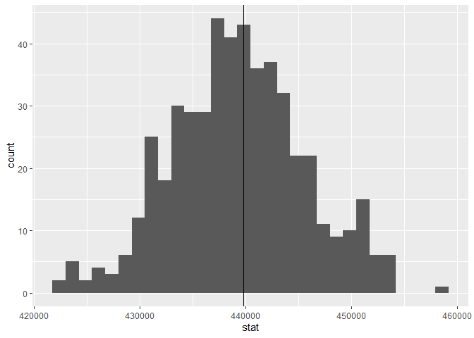
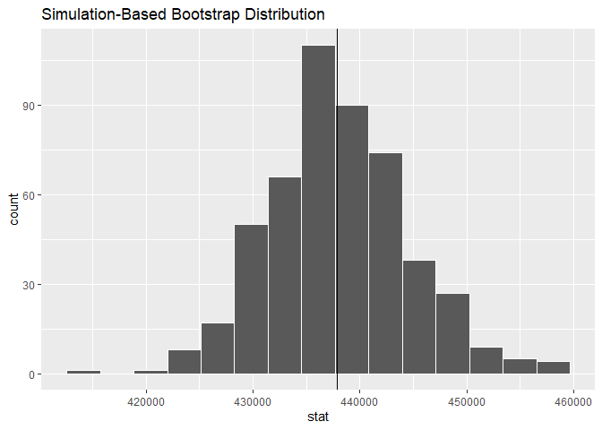
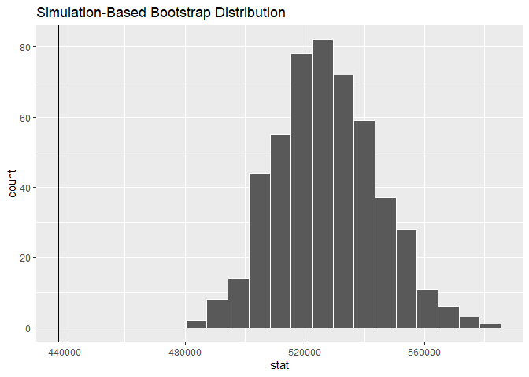
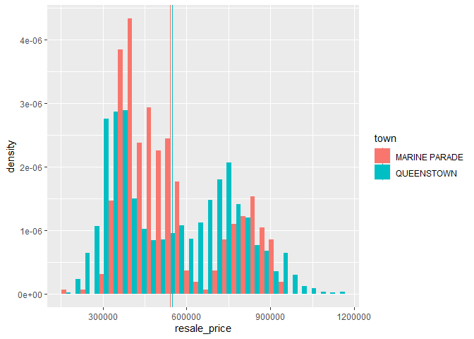
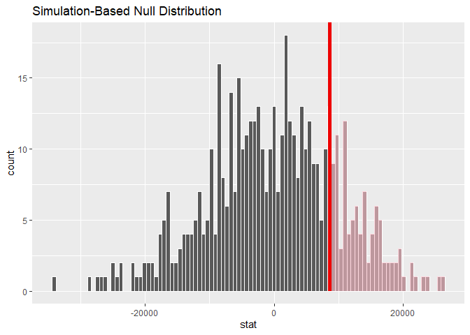

Block4: sample statistics
================

``` r
library(tidyverse)
```

    ## -- Attaching packages ----------------------------------------------------------------- tidyverse 1.3.0 --

    ## v ggplot2 3.3.2     v purrr   0.3.4
    ## v tibble  3.0.3     v dplyr   1.0.0
    ## v tidyr   1.1.0     v stringr 1.4.0
    ## v readr   1.3.1     v forcats 0.5.0

    ## -- Conflicts -------------------------------------------------------------------- tidyverse_conflicts() --
    ## x dplyr::filter() masks stats::filter()
    ## x dplyr::lag()    masks stats::lag()

``` r
library(here)
```

    ## here() starts at C:/Users/Kateryna/Documents/2020/IndependentStudy/Rstudio

``` r
library(e1071)
library(skimr)
library(lubridate)
```

    ## 
    ## Attaching package: 'lubridate'

    ## The following objects are masked from 'package:base':
    ## 
    ##     date, intersect, setdiff, union

``` r
library(forcats)
library(ggplot2)
library(infer)
sales <- readRDS(here::here("data/sales.rds"))

mu <- sales %>% 
  summarize(stat = mean(resale_price))

mu
```

    ## # A tibble: 1 x 1
    ##      stat
    ##     <dbl>
    ## 1 439793.

``` r
sales %>% 
  sample_n(100) %>% 
  summarize(stat = mean(resale_price))
```

    ## # A tibble: 1 x 1
    ##      stat
    ##     <dbl>
    ## 1 445452.

``` r
sample_mean <- function(data, size = 500) {
  data %>% 
    sample_n(size) %>% 
    summarize(stat = mean(resale_price))
}

sampled_means <- rerun(500, sample_mean(sales)) %>% bind_rows()

sampled_means %>% 
  ggplot(aes(x = stat)) + geom_histogram() +
  geom_vline(xintercept=mu$stat)
```

    ## `stat_bin()` using `bins = 30`. Pick better value with `binwidth`.

<!-- -->

``` r
#sample of 500 (from the entire database)
sales_sample <- sales %>%
  sample_n(500)

# mean of the sample
x_bar <- sales_sample %>% 
  summarize(stat = mean(resale_price))
x_bar
```

    ## # A tibble: 1 x 1
    ##      stat
    ##     <dbl>
    ## 1 437837.

``` r
# same with different library
sales_sample %>% 
  specify(response = resale_price) %>%
  calculate(stat = "mean")
```

    ## # A tibble: 1 x 1
    ##      stat
    ##     <dbl>
    ## 1 437837.

``` r
# Bootstrapping 
bootstrapped_resale_price <- sales_sample %>% 
  specify(response = resale_price) %>% 
  generate(reps = 500) %>% 
  calculate(stat = "mean")
```

    ## Setting `type = "bootstrap"` in `generate()`.

``` r
bootstrapped_resale_price %>% 
  visualise() +
  geom_vline(xintercept = x_bar$stat)
```

<!-- -->

``` r
bootstrapped_resale_price %>% 
  get_ci()
```

    ## # A tibble: 1 x 2
    ##   lower_ci upper_ci
    ##      <dbl>    <dbl>
    ## 1  426313.  452325.

### Exercise 1: Using RStudio’s help panel, find out how to use the standard error method with get\_ci. Do you find the same values?

### Exercise 2: Try changing the value of your confidence level (by default, get\_ci uses 0.95). What do you observe as you ask for higher confidence levels?

### Exercise 3: Repeat the previous steps using a different value for n, the size of our original sample. What does the new confidence interval compare to the previous one?

``` r
# Confidence intervals for subsets: 
#x_bar_mp_all <- sales %>% 
#  filter(town == "MARINE PARADE") %>% 
#  summarize(stat = mean(resale_price))

#x_bar_mp
```

``` r
sales %>% 
  #filter(floor_area_sqm == 67) %>% 
  filter(town == "MARINE PARADE") %>% 
  View()


#sample of 500 (from the entire database)
sales_sample_mp <- sales %>%
  filter(town == "MARINE PARADE") %>% 
  sample_n(100) # Error: `size` must be less or equal than 485 (size of data), set `replace` = TRUE to use sampling with replacement.

# mean of the sample
x_bar_mp <- sales_sample_mp %>% 
  summarize(stat = mean(resale_price))
x_bar_mp
```

    ## # A tibble: 1 x 1
    ##      stat
    ##     <dbl>
    ## 1 528647.

``` r
bootstrapped_resale_price_mp <- sales_sample_mp %>% 
  filter(town == "MARINE PARADE") %>% 
  specify(response = resale_price) %>% 
  generate(reps = 500) %>% 
  calculate(stat = "mean")
```

    ## Setting `type = "bootstrap"` in `generate()`.

``` r
bootstrapped_resale_price_mp %>% 
  visualise() +
  geom_vline(xintercept = x_bar$stat)
```

<!-- -->

``` r
bootstrapped_resale_price_mp %>% 
  get_ci()
```

    ## # A tibble: 1 x 2
    ##   lower_ci upper_ci
    ##      <dbl>    <dbl>
    ## 1  497263.  562226.

``` r
# 4.4 Comparing means between groups

town_means <- sales %>%
  filter(town == "QUEENSTOWN" | town == "MARINE PARADE") %>%
  group_by(town) %>%
  summarise(mean = mean(resale_price))
```

    ## `summarise()` ungrouping output (override with `.groups` argument)

``` r
town_means
```

    ## # A tibble: 2 x 2
    ##   town             mean
    ##   <chr>           <dbl>
    ## 1 MARINE PARADE 540409.
    ## 2 QUEENSTOWN    549037.

``` r
ggplot() +
  geom_histogram(
    data = sales %>%
      filter(town == "QUEENSTOWN" | town == "MARINE PARADE"),
    mapping = aes(x = resale_price, y = ..density.., group = town, fill = town),
    position = position_dodge()
  ) +
  geom_vline(
    data = town_means,
    mapping = aes(xintercept = mean, group = town, color = town)
  )
```

    ## `stat_bin()` using `bins = 30`. Pick better value with `binwidth`.

<!-- -->

``` r
bootstrapped_resale_price_qt <- sales %>% 
  filter(town == "QUEENSTOWN") %>% 
  specify(response = resale_price) %>% 
  generate(reps = 100) %>% 
  calculate(stat = "mean")
```

    ## Setting `type = "bootstrap"` in `generate()`.

``` r
bootstrapped_resale_price_qt %>% 
  get_ci()
```

    ## # A tibble: 1 x 2
    ##   lower_ci upper_ci
    ##      <dbl>    <dbl>
    ## 1  541578.  557903.

``` r
# test the significance of the difference more formally with infer

mean_diff <- sales %>% 
  filter(town == "MARINE PARADE" | town == "QUEENSTOWN") %>% 
  specify(formula = resale_price ~ town) %>% 
  calculate(stat = "diff in means", order = c("QUEENSTOWN", "MARINE PARADE"))
mean_diff
```

    ## # A tibble: 1 x 1
    ##    stat
    ##   <dbl>
    ## 1 8628.

``` r
# We then generate a set of sampled datasets. But instead of doing a simple bootstrap, we generate each sample based on the null hypothesis, namely that there is no difference between the mean of the two towns.

null_distribution <- sales %>% 
  filter(town == "MARINE PARADE" | town == "QUEENSTOWN") %>% 
  specify(formula = resale_price ~ town) %>% 
  hypothesize(null = "independence") %>% 
  generate(reps = 500, type = "permute") %>% 
  calculate(stat = "diff in means", order = c("QUEENSTOWN", "MARINE PARADE"))

null_distribution %>% 
  visualise(bins = 100) +
  shade_p_value(obs_stat = mean_diff, direction = "greater")
```

<!-- -->

``` r
null_distribution %>% 
  get_pvalue(obs_stat = mean_diff, direction = "greater")
```

    ## # A tibble: 1 x 1
    ##   p_value
    ##     <dbl>
    ## 1   0.204

``` r
sales %>% 
  filter(town == "MARINE PARADE" | town == "QUEENSTOWN") %>% 
  specify(formula = resale_price ~ town) %>% 
  # hypothesize(null = "independence") %>% # disable the null hypothesis
  generate(reps = 500, type = "bootstrap") %>% # set type to bootstrap
  calculate(stat = "diff in means", order = c("QUEENSTOWN", "MARINE PARADE")) %>% 
  get_ci()
```

    ## # A tibble: 1 x 2
    ##   lower_ci upper_ci
    ##      <dbl>    <dbl>
    ## 1  -10927.   24417.

### Exercise 4: In the RStudio help, find out what the direction argument does for the get\_p\_value and shade\_p\_value functions. Try setting it to both on the data above.

### Exercise 5: Are the resale prices means between Marine Parade and Bukit Timah significantly different?

### Exercise 6: During the previous week, we saw that the price of a flat can be quite different depending on what storey the flat is located on. Use the same procedure to see if the average price of 3 room flats on storey 04-06 is significantly different from 3 room flats on storey 07-09.
